# 作品集

## ASP.Net core MVC 網頁
* 完成CRUD功能
* 使用FullCalendar 完成預排點檢行事曆
  * 點檢完成儲存至DB，並可匯出Excel
* 使用 jQuery的 $.Ajax() 技術
* AD 帳密驗證
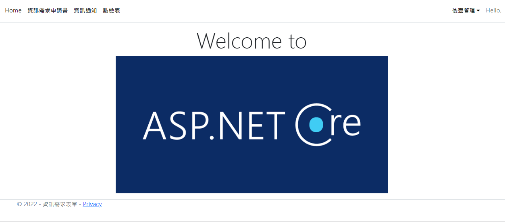
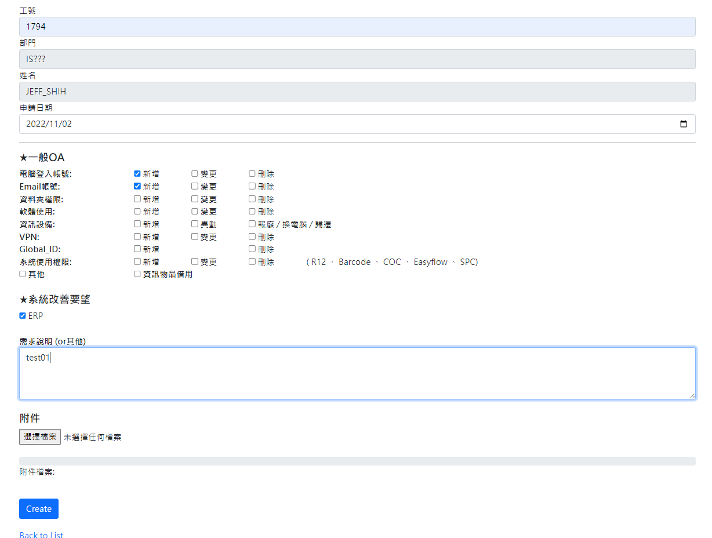
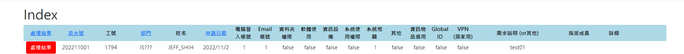
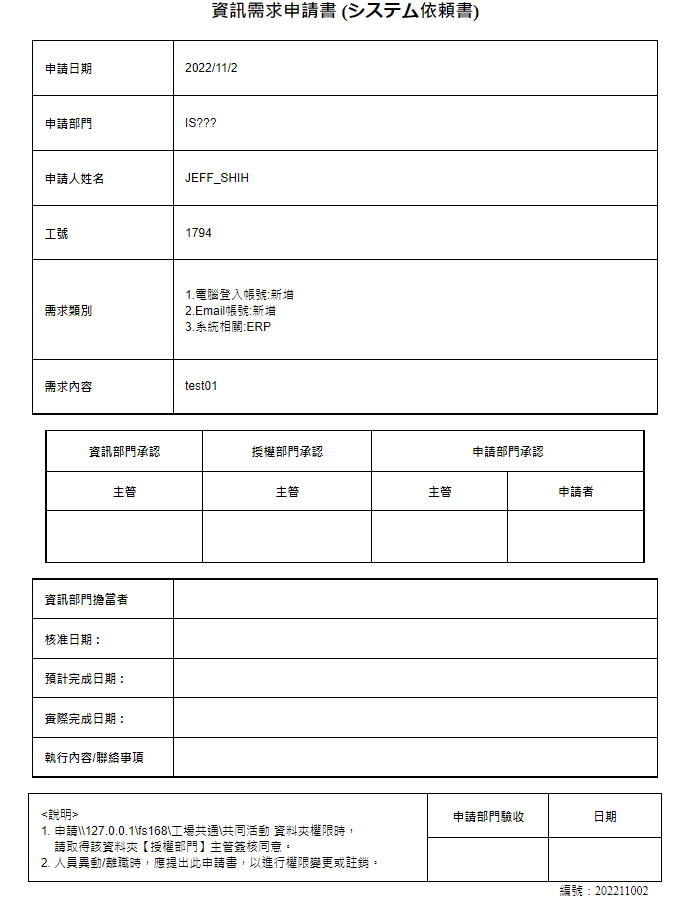
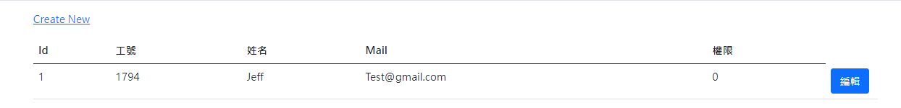
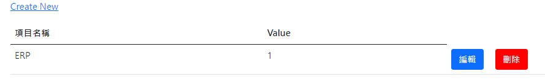
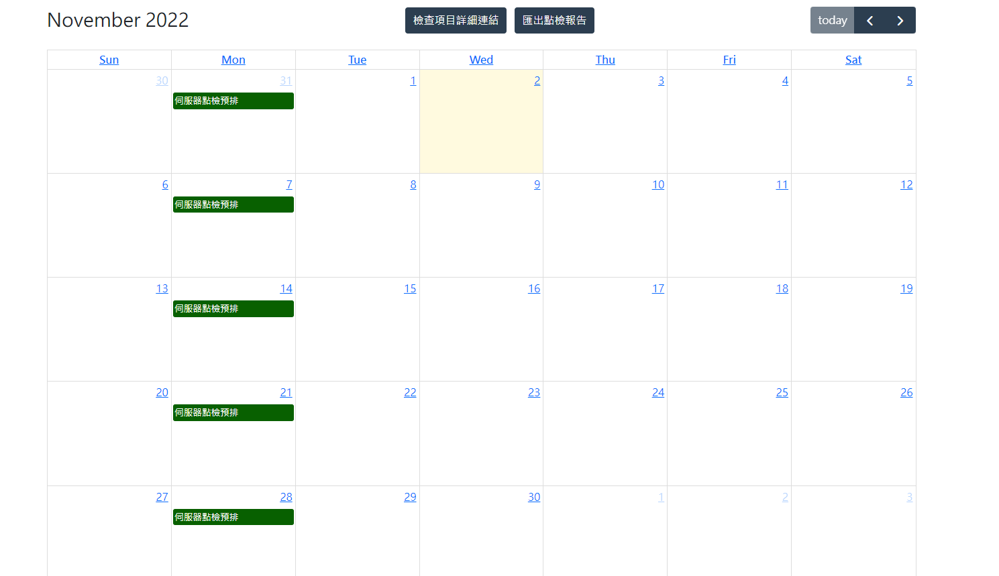

## 推薦系統網站(專題)
* 使用Python Django框架建立網站 
* 以doc2vec為基礎做了推薦系統API，並套用到網頁上，利用數據分析使用者的喜好並推薦相似的使用者或內容
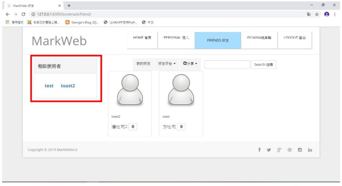
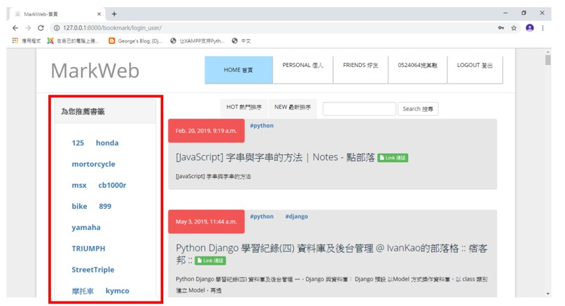

## 藍芽接收資料並圖像化
* Python QT5
* pyqtgraph 、 matplotlib.animation 
* Multi-threading

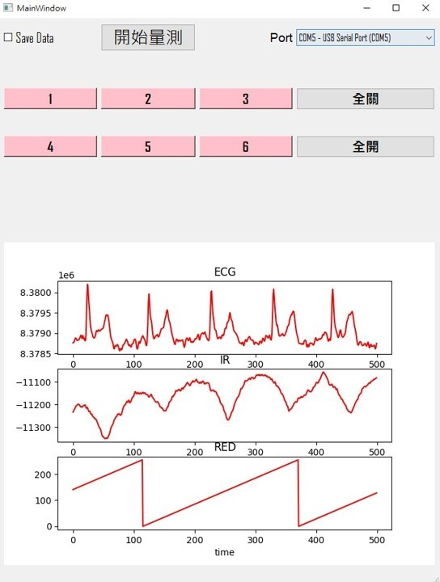
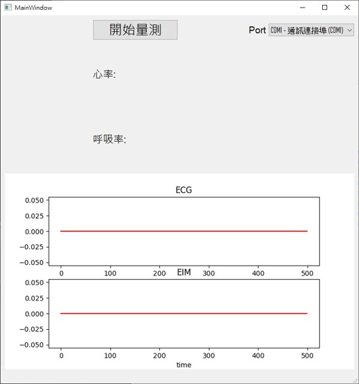
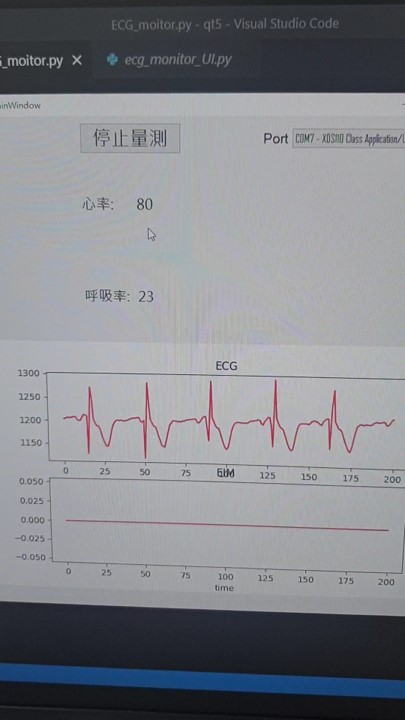
